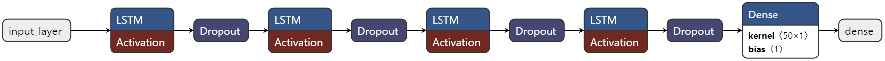
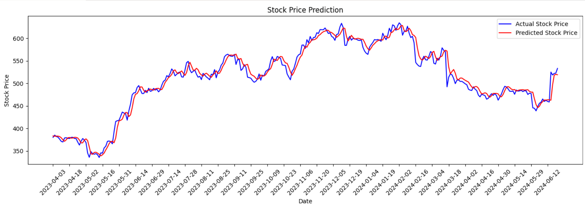
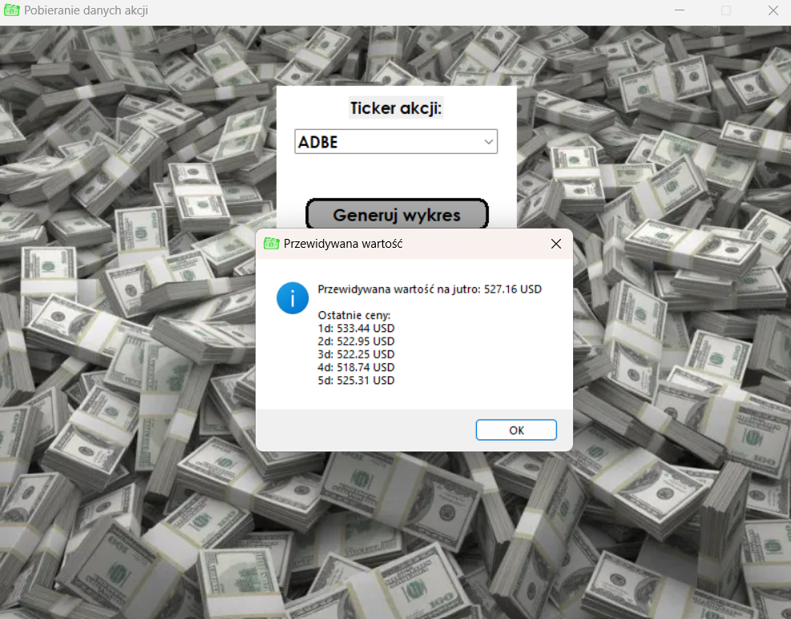

# Stock Price Prediction Project


## Project Overview

This project aims to predict future stock prices using historical stock data and a Long Short-Term Memory (LSTM) neural network. The main objective is to provide a reliable model that can forecast stock prices, helping investors make informed decisions based on predicted market trends.

The project encompasses data retrieval, preprocessing, model training, and evaluation. Historical stock data is collected using yfinance, which is then processed and used to train an LSTM model. The trained model is capable of predicting future stock prices based on the historical patterns it has learned.

### AWS Integration

To leverage scalable and high-performance computing resources, the model training process was carried out using AWS (Amazon Web Services). AWS provides a suite of cloud services that are ideal for running machine learning workloads, ensuring efficient and fast model training. The training of the model was multi-layered, which means that the model was trained on data for one stock at a time instead of data for all stocks simultaneously.

Using AWS, the project benefits from:
- Scalable computing power that adjusts based on the training workload.
- Robust storage solutions for handling large datasets and model files.
- Enhanced security features ensuring the safe handling of data and model artifacts.

## Technologies Used

- Python
- TensorFlow
- Keras
- Pandas
- NumPy
- Scikit-learn
- yfinance
- AWS (Amazon Web Services)
- PySpark
- Apache Spark
- EMR

## Project Structure

- `stock_data`
- `get_data.py`
- `main.py`
- `predict.py`
- `retrain.py`
- `test.py`
- `tickers.py`
- `updated_model.keras`
- `dolary.png`, `dollaricon.png`


### get_data.py

This script downloads historical stock data for a list of tickers from Yahoo Finance and uploads the data to an AWS S3 bucket. The script uses yfinance to fetch the stock data and boto3 to interact with S3.

**Dependencies:**
- `yfinance`
- `pandas`
- `boto3`
- `io`

### Modules:
- `tickers` - A custom module that should contain a list named `tickers` with the stock tickers you want to fetch data for.

### AWS Configuration:
- Ensure that your AWS credentials are properly configured for accessing S3.

### Variables:
- `s3_bucket` - The name of the S3 bucket where the data will be uploaded.
- `start_date` - The start date for the historical data.
- `end_date` - The end date for the historical data.

### main.py

This script creates a graphical user interface (GUI) for fetching and predicting stock data. The GUI allows users to enter a stock ticker, view historical stock prices, and predict future prices.

**Dependencies:**
- `matplotlib`
- `tkinter`
- `tkcalendar`
- `PIL`
- `pandas`
- `datetime`
- `custom modules: tickers, predict`

### Functions:
- `create_rounded_rect_button(canvas, x, y, width, height, radius, text, command)` - Creates a button with rounded corners on a canvas.
- `update_combobox(event)` - Updates the combobox with ticker suggestions based on user input.
- `format_date_for_display(date)` - Formats a date object into a human-readable string.


### tickers.py

This script defines the list of stock tickers that are used in the project.

**Key Variables:**
- `tickers`: A list of stock tickers to be used for data retrieval and prediction.


### train.py

This script is responsible for training the LSTM model using the historical stock data. It includes functions to create the LSTM model, train it, and evaluate its performance.

**Dependencies:**
- `pandas`
- `numpy`
- `tensorflow`
- `matplotlib`
- `sklearn`
- `pyspark`
- `boto3`

**Key Functions:**
- `load_data_from_s3(bucket, path)` - Loads stock price data from an S3 bucket.
- `train_model()` - Trains the LSTM model on the stock price data and saves the trained model to S3.
- `test_model(x_test, y_test, scaler)` - Loads the trained model from S3 and tests it on the test data, plotting the results.

### retrain.py

This script retrains an existing LSTM model using new stock data and uploads the updated model to an AWS S3 bucket. 
The script loads the existing model and new data from S3, retrains the model, and saves the updated model back to S3.

**Dependencies:**
- `pandas`
- `sklearn`
- `numpy`
- `tensorflow`
- `boto3`
- `io`

**AWS Configuration:**
- Ensure that your AWS credentials are properly configured for accessing S3.

**Variables:**
- `s3_bucket` - The name of the S3 bucket.
- `existing_model_file` - The S3 key for the existing model file.
- `new_data_file` - The S3 key for the new stock data file.
- `updated_model_file` - The S3 key for the updated model file.

**Functions:**
- `load_data_from_s3(bucket, path)` - Loads data from an S3 bucket.
- `load_and_train_model(existing_model_s3_path, new_data_s3_path)` - Loads the existing model and new data from S3, retrains the model, and uploads the updated model to S3.


### updated_model.keras
This is the pre-trained LSTM model saved in keras format, that consists a JSON-based configuration file, H5-based state file and metadata file in JSON, storing things such as the current Keras version. It is used by `evaluate.py` to generate stock price forecasts.


### your_stock_data.csv
This CSV file contains historical stock data used for training and evaluation. It includes columns like `Date`, `Open`, `High`, `Low`, `Close`, `Volume`, etc.

## Usage

1. **Install dependencies**:
    ```bash
    pip install -r requirements.txt
    ```

2. **Retrieve historical data**:
    ```bash
    python get_data.py
    ```

3. **Train the model**:
    ```bash
    python train.py
    ```

4. **Evaluate the model and generate forecasts**:
    ```bash
    python evaluate.py
    ```

5. **Run the main script**:
    ```bash
    python main.py
    ```
### Model structure


Input layer:

`Input layer`: Accepts the input data, which is the historical stock price sequences.

First LSTM Layer:

`LSTM(100, return_sequences=True, input_shape=(x_train.shape[1], 1))`: This layer is a Long Short-Term Memory (LSTM) layer with 100 units (neurons). The return_sequences=True parameter ensures that the layer returns the full sequence to the next layer.

First Dropout Layer:

`Dropout(0.2)`: This layer randomly sets input units to 0 with a frequency of 20% at each step during training time

Second LSTM Layer:

`LSTM(50, return_sequences=True)`: Another LSTM layer with 50 units, also returning the full sequence.

Second Dropout Layer:

`Dropout(0.2)`: The same dropout layer as the previous one.

Third LSTM Layer:

`LSTM(50, return_sequences=True)`: The same LSTM layer as the previous one.

Third Dropout Layer:

`Dropout(0.3)`: Increases the dropout rate to 30%.

Fourth LSTM Layer:

`LSTM(50, return_sequences=False)`: This LSTM layer also has 50 units but does not return the full sequences (return_sequences=False).

Fourth Dropout Layer:

`Dropout(0.3)`: Similar to the previous dropout layer, it helps in reducing overfitting by omitting 30% of the units.

Dense Layer:

`Dense(1)`: This is the output layer of the network. The use of a single unit corresponds to the prediction of a single continuous value, which is the stock price.

Output Layer:

`Output layer`: The final layer that provides the predicted stock price.

The model uses the Adam optimizer and mean squared error as the loss function. After training, the model is saved to an AWS S3 bucket and can be reloaded to make predictions on new data.


## Final Effect


The GUI includes a dropdown list containing ninety different companies to choose from and two buttons that function as follows:

***Generuj wykres*** - After selecting a company from the list and pressing this button, the model predicts the stock values of the chosen company based on historical data. Once this operation is complete, charts of historical stock values and the values predicted by the model are displayed in a new window, allowing for an assessment of the model's prediction accuracy.


*Charts of historical and predicted values for the company ADBE.*

***Przewiduj*** - After selecting a company from the list and pressing this button, the model predicts the stock value for the day following the last day in the historical stock value database. After making the prediction, a pop-up window displays the predicted value along with the values of the five preceding days, providing context and ensuring the realism of the prediction result.


*Window with the predicted stock value for the next day for the company ADBE.*

## Acknowledgments

- The Yahoo Finance API for providing historical stock data.
- TensorFlow and Keras for the machine learning framework.

## Authors 
- Michał Jankowski
- Dominik Gołembowski
- Mateusz Debis
- Maksymlian Anzulewicz
- Michał Wera
- Bartosz Hermanowski
- Adam Hinc
- Patryk Kosmalski
- Mateusz Gościniecki
- Jakub Ławicki
